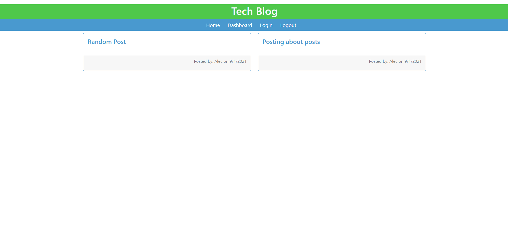
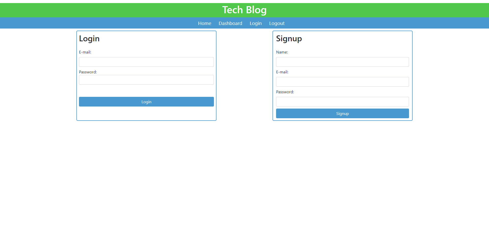
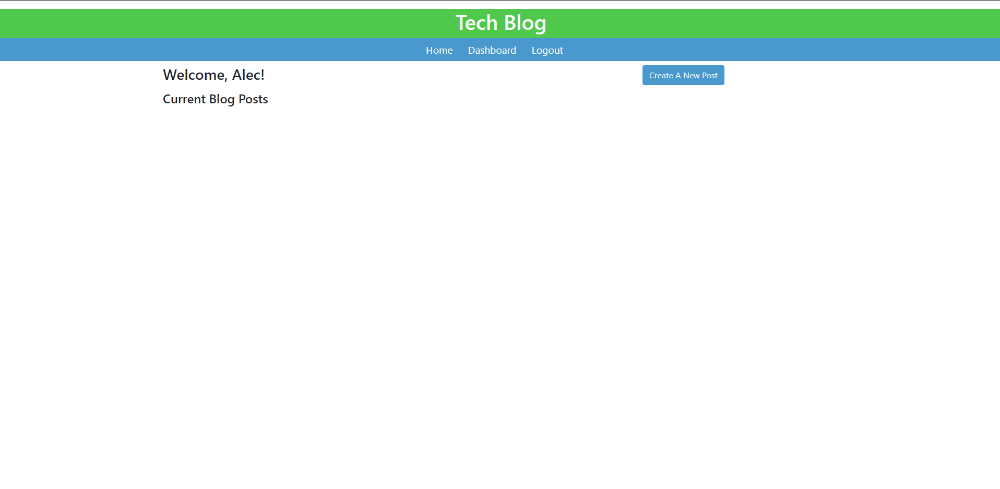

# TechBlog 

  ## Description

  * Create a CMS-style blog site similar to a Wordpress site starting from scratch
  * Use Model Views Controller(MVC) Paradigm
  * Use Handlebars.js as templating language
  * Sequelize used as the Object Relational Mapping(ORM)
  * Users can login, signup, create/view/delete/update posts, and add comments to previous posts
  
  
  ## Table of Contents
  * [Installation](#installation)
  * [Usage](#usage)
  * [Contributing](#contributing)
  * [License](#license)
  
  ## Installation

  n/a

  ## Usage

  Navigate to the live webpage! https://tranquil-sierra-39705.herokuapp.com/

  ## Home Page
  
  ## Login/Signup
  
  ## Dashboard
  

  ## Contributing

  For contributions please open an issue or new pull request

  ## Test

  n/a
  
  ## Questions

  I can answer questions via email or through github

  * Github Profile: [Alec74](https://github.com/Alec74)
  * alecmcglone@gmail.com
  * LinkedIn: [Alec](https://www.linkedin.com/in/alec-mcglone-900904206/)
  
  ## License
  Notice: This application is licensed under MIT
  
  [License-Link](./LICENSE)